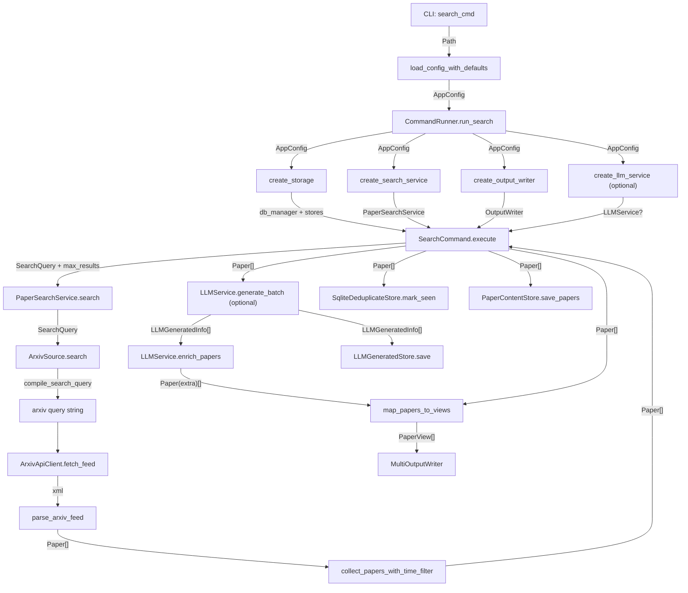

# Codebase Overview

## Overview

按固定流程梳理 Paper Tracker 的实现结构，避免“按文件罗列”。
优先输出模块边界、调用链路、核心数据结构流动，再补充模块细节。
默认文档风格参考 `.ai_docs/rules/project_overview.md`，但只保留主流程，不做实现级展开。

## Workflow

1. 确认入口与主执行路径
- 入口：`src/PaperTracker/__main__.py` -> `src/PaperTracker/cli/ui.py`。
- 主链路：`CommandRunner.run_search()` -> `SearchCommand.execute()`。

2. 按目录拆分模块
- `cli`: 命令行入口、参数接收、流程调度。
- `config`: YAML 解析、默认配置合并、跨域校验。
- `core`: 领域模型与查询 DSL（系统内统一语义）。
- `services`: 用例服务层，承接 CLI 与 source。
- `sources/arxiv`: 查询编译、HTTP 获取、解析与分页策略。
- `llm`: 可选的翻译/摘要增强链路。
- `renderers`: 视图映射与多格式输出。
- `storage`: 去重、内容存档、LLM 结果落库。

3. 按模块说明固定维度
- 职责：这个模块解决什么问题。
- 输入：接收哪些核心对象。
- 输出：产出哪些核心对象。
- 依赖：调用了哪些模块或外部系统。
- 风险点：并发、重试、幂等、数据一致性相关约束。

4. 先给全局图，再给分模块说明
- 必须先放 Mermaid 全局调用图（带数据结构流向标注）。
- 再按模块展开，避免读者先陷入实现细节。

5. 调用链粒度控制（新增）
- 调用链写到“主要函数名”即可，覆盖 CLI -> config -> service -> source -> llm(可选) -> renderer -> storage(可选)。
- 不展开辅助函数、工具函数、模板细节、重试/限流内部实现等次要链路。
- 默认每个模块给 2-4 条主链路，不做全量函数清单。
- 若用户明确要求“更详细”，再补函数级链路；若用户反馈“太细”，立即回退到主链路版本。

6. 输出格式约束（新增）
- 不使用表格描述模块，统一使用次级标题 + 分条陈述。
- 模块说明优先写“目录/职责/关键对象”。
- 调用链章节标题统一为“主要调用链（函数级）”。

7. 文档落点约束（新增）
- 涉及项目中文文档输出，默认写入 `docs/zh/`。
- 文档命名建议：`architecture_*.md` 或用户指定名称。

## Module Map（无表格）

### CLI 与调度
- 目录：`src/PaperTracker/cli`
- 主要职责：命令入口、配置加载、执行编排
- 关键对象：`CommandRunner`, `SearchCommand`

### 配置系统
- 目录：`src/PaperTracker/config`
- 主要职责：解析 YAML、校验域配置
- 关键对象：`AppConfig`, `SearchConfig`

### 领域模型
- 目录：`src/PaperTracker/core`
- 主要职责：定义统一查询与论文实体
- 关键对象：`SearchQuery`, `Paper`, `LLMGeneratedInfo`

### 搜索服务
- 目录：`src/PaperTracker/services`
- 主要职责：用例层封装 source 调用
- 关键对象：`PaperSearchService`

### arXiv 适配器
- 目录：`src/PaperTracker/sources/arxiv`
- 主要职责：编译查询、抓取、解析、时间窗口分页
- 关键对象：`ArxivSource`, `collect_papers_with_time_filter`

### LLM 增强
- 目录：`src/PaperTracker/llm`
- 主要职责：翻译/摘要生成与回填
- 关键对象：`LLMGeneratedInfo`, `Paper.extra`

### 渲染输出
- 目录：`src/PaperTracker/renderers`
- 主要职责：领域对象映射和多格式输出
- 关键对象：`PaperView`, `MultiOutputWriter`

### 存储层
- 目录：`src/PaperTracker/storage`
- 主要职责：去重、内容存储、LLM 存储
- 关键对象：`SqliteDeduplicateStore`, `PaperContentStore`, `LLMGeneratedStore`

## Call Flow And Data Flow

## Core Data Structures

- `AppConfig`: 根配置对象，贯穿组件构建阶段。
- `SearchQuery` / `FieldQuery`: 查询 DSL，从 config 进入 source 编译。
- `Paper`: 系统 canonical 论文模型，source/search/llm/render/storage 共享。
- `LLMGeneratedInfo`: LLM 生成的翻译与摘要结构，后续回填到 `Paper.extra`。
- `PaperView`: 面向展示的视图模型，仅用于输出层。

## Module-by-Module Guide

### 1. CLI 与调度 (`cli`)
- 读取 `.env` 与配置文件。
- 创建服务/存储/渲染依赖并注入 `SearchCommand`。
- 负责资源释放和顶层异常处理。

### 2. 配置系统 (`config`)
- 将 YAML 映射为强类型 dataclass。
- 执行域内校验（search/output/storage/llm）。
- 处理默认配置与覆盖配置深度合并。

### 3. 领域与查询 (`core`)
- `SearchQuery` 表示用户意图，不绑定具体 source 语法。
- `Paper` 是全链路统一实体，避免不同模块各自定义论文结构。

### 4. Source 与抓取策略 (`services` + `sources/arxiv`)
- `PaperSearchService` 提供稳定用例接口。
- `ArxivSource` 完成 query 编译、HTTP 抓取、解析和多轮分页策略。
- `collect_papers_with_time_filter` 处理时间窗口、限流、去重与早停。

### 5. LLM 增强 (`llm`)
- 可选链路，不影响基础搜索。
- 产出 `LLMGeneratedInfo` 并回填 `Paper.extra`，对输出层透明。

### 6. 渲染输出 (`renderers`)
- `map_papers_to_views` 将 `Paper` 投影成 `PaperView`。
- `MultiOutputWriter` 并行分发到 console/json/markdown/html writer。

### 7. 存储层 (`storage`)
- `seen_papers`: 去重主表。
- `paper_content`: 论文内容快照。
- `llm_generated`: LLM 增强结果。
- 写入时机在输出之后，降低“写库成功但输出失败”的不一致风险。

## Output Template

按以下结构组织最终架构说明：

1. 总览（1 段）
2. 模块拆分（次级标题 + 分条）
3. Mermaid 调用与数据流图
4. 核心数据结构说明
5. 主要调用链（函数级，主链路）
6. 按模块详解（每个模块 3-5 行）
7. 风险与改进点（可选）

注意：
- “主要调用链”只保留关键函数，不展开工具细节。
- 用户若要求“更详细/更简化”，按粒度控制规则增减内容。
