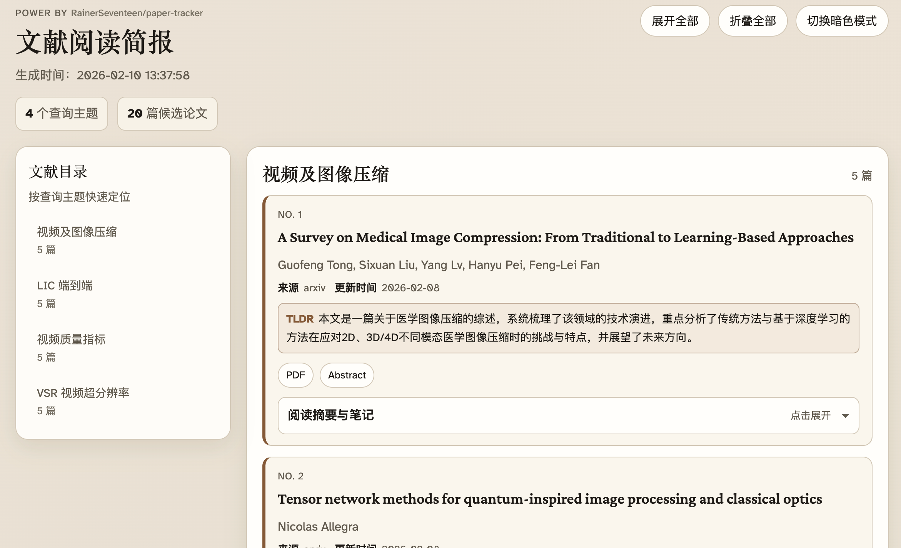

# Paper Tracker

> The following content was translated using a large language model (LLM)

[](https://www.python.org/downloads/)
[](./LICENSE)
[](https://github.com/rainerseventeen/paper-tracker/releases)
[](https://github.com/rainerseventeen/paper-tracker/commits)
[](https://github.com/rainerseventeen/paper-tracker)
[](https://github.com/rainerseventeen/paper-tracker/graphs/commit-activity)

**English | [中文](./README.md)**

Paper Tracker is a minimal paper tracking tool with the core goal of querying arXiv based on keywords and outputting structured results according to configuration, making it easy to continuously track new papers.

**If this project is helpful to you, please consider giving it a Star ⭐, thank you!**

## ✨ Demo

View the actual running results: [📄 Deployment Release Page](https://rainerseventeen.github.io/paper-tracker/)



This page showcases automatically fetched and generated paper lists based on configuration files, including:
- 🔍 Latest papers filtered by keywords
- 📋 Structured paper information (title, authors, abstract, links)
- 🤖 Optional LLM-enhanced abstracts (if enabled)

## 📦 Implemented Features

- 🔍 **Query & Filtering**:
  - Query papers based on arXiv API
  - Support field-specific retrieval: `TITLE`, `ABSTRACT`, `AUTHOR`, `JOURNAL`, `CATEGORY`
  - Support logical operations: `AND`, `OR`, `NOT`
  - Support global `scope` (applies to all queries)
- 📥 **Fetch Strategy**: Support fetching older papers to complete the target paper count

- 💾 **Deduplication & Storage**: SQLite deduplication functionality, and paper content storage for future queries

- 📤 **Output Capabilities**: Support output formats like `json`, `markdown`, `html`, support template replacement
- 🤖 **LLM Enhancement**: Support OpenAI-compatible API calls, including abstract translation and structured summary support
- 🌐 **Configurable Output Language**: You can customize translation/summary output language via `llm.target_lang` (for example `Simplified Chinese`, `English`, `Japanese`)

## 🚀 Quick Start

It is recommended to use a virtual environment (e.g., `.venv/`):
```bash
python3 -m venv .venv
```
Install:
```bash
python -m pip install -e .
```

### (Optional) Configure API Environment Variables

If LLM summarization is enabled, you need to configure environment variables:

```bash
cp .env.example .env
# Edit .env and fill in your LLM_API_KEY
```

### Run Command

```bash
paper-tracker search --config config/default.yml
```

## ⚙️ Custom Configuration

> Note: The project first reads the default configuration from `config/default.yml`, then reads the file at the `--config` parameter path to override the defaults, so please do not modify `default.yml`

```bash
# Create a custom configuration file
cp config/default.yml config/custom.yml
```
After modifying config/custom.yml for your personal settings, execute:

```bash
paper-tracker search --config config/custom.yml
```

You need to pay attention to at least two items:

- 🔎 `queries`: Set at least one custom query request scheme
- 📤 `output.formats`: At least 1 output format

📚 Detailed guides can be found in the documentation:
- [📖 User Guide](./docs/en/guide_user.md)

- [⚙️ Detailed Parameter Configuration](./docs/en/guide_configuration.md)

- [🔍 arXiv Query Syntax](./docs/en/source_arxiv_api_query.md)

## Updates

To update to the latest version:

```bash
cd paper-tracker
git pull
python -m pip install -e . --upgrade
```

## Feedback

If you encounter any issues or have feature suggestions, please submit them at [GitHub Issues](https://github.com/rainerseventeen/paper-tracker/issues).

Please provide log information from the run (default in the `log/` directory).

## License

This project is licensed under the [MIT License](./LICENSE).

## 🙏 Acknowledgments

This repository is an independent implementation, inspired by the functional ideas of the following projects:

- [Arxiv-tracker](https://github.com/colorfulandcjy0806/Arxiv-tracker)
- [daily-arXiv-ai-enhanced](https://github.com/dw-dengwei/daily-arXiv-ai-enhanced)
