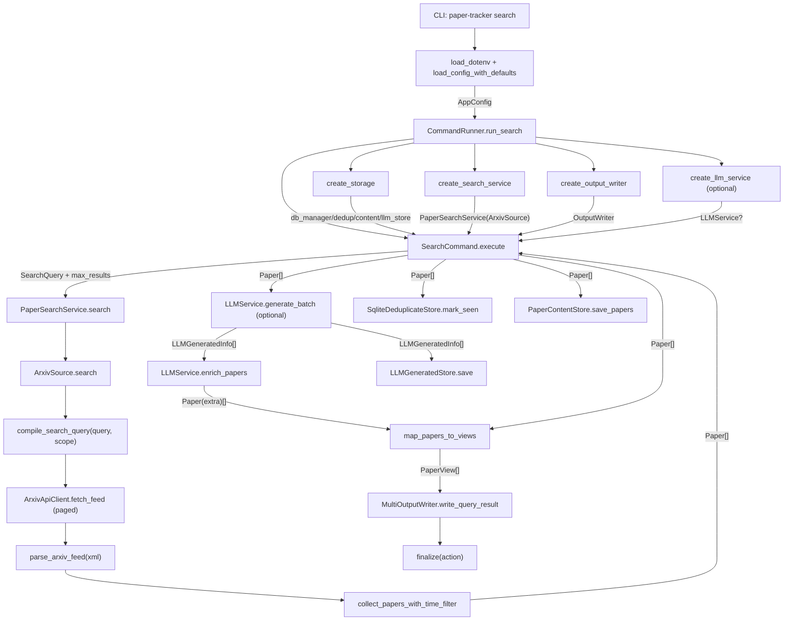

# Paper Tracker 项目代码流程总览

## 1. 总览

Paper Tracker 当前以 `search` 命令为主链路：CLI 读取配置并构建依赖，服务层将统一查询语义下发到 arXiv 适配器，抓取后的 `Paper` 进入可选 LLM 增强，再映射为 `PaperView` 输出到多格式 writer，最后按条件落库用于去重与内容沉淀。整体设计采用“配置驱动 + 领域模型统一 + 适配器隔离外部 API”的分层结构。

## 2. 模块拆分

### 2.1 CLI 与调度

- 目录：`src/PaperTracker/__main__.py`, `src/PaperTracker/cli`
- 主要职责：命令入口、配置加载、依赖编排、执行与清理
- 关键对象：`CommandRunner`, `SearchCommand`

### 2.2 配置系统

- 目录：`src/PaperTracker/config`
- 主要职责：YAML 解析、默认值合并、域内校验
- 关键对象：`AppConfig`, `SearchConfig`

### 2.3 领域模型与查询 DSL

- 目录：`src/PaperTracker/core`
- 主要职责：定义统一论文实体与查询语义
- 关键对象：`Paper`, `LLMGeneratedInfo`, `SearchQuery`, `FieldQuery`

### 2.4 搜索服务层

- 目录：`src/PaperTracker/services`
- 主要职责：用例级搜索接口，桥接 CLI 与 source
- 关键对象：`PaperSearchService`

### 2.5 arXiv 适配器

- 目录：`src/PaperTracker/sources/arxiv`
- 主要职责：查询编译、HTTP 拉取、XML 解析、多轮分页与时间窗口策略
- 关键对象：`ArxivSource`, `collect_papers_with_time_filter`

### 2.6 LLM 增强

- 目录：`src/PaperTracker/llm`
- 主要职责：批量翻译/摘要生成并回填论文扩展字段
- 关键对象：`LLMService`, `LLMProvider`

### 2.7 渲染输出

- 目录：`src/PaperTracker/renderers`
- 主要职责：领域对象映射与多格式输出汇总
- 关键对象：`PaperView`, `MultiOutputWriter`

### 2.8 存储层

- 目录：`src/PaperTracker/storage`
- 主要职责：SQLite 连接管理、去重、论文内容与 LLM 结果存储
- 关键对象：`DatabaseManager`, `SqliteDeduplicateStore`, `PaperContentStore`, `LLMGeneratedStore`

## 3. 调用与数据流图

## 4. 核心数据结构

- `AppConfig`：全局配置根对象，贯穿组件构建阶段。
- `SearchQuery` / `FieldQuery`：统一查询 DSL，避免 CLI 直接绑定 arXiv 语法。
- `Paper`：系统标准论文实体，source、service、llm、renderer、storage 共用。
- `LLMGeneratedInfo`：LLM 生成结果载体，后续回填到 `Paper.extra`。
- `PaperView`：展示层模型，隔离输出格式与领域模型。

## 5. 主要调用链（函数级）

### 5.1 CLI 主链

- `main()` -> `cli()` -> `search_cmd(...)`
- `search_cmd(...)` -> `load_config_with_defaults(...)` -> `CommandRunner.run_search(...)`
- `run_search(...)` -> 创建 `storage/search_service/output_writer/llm_service` -> `SearchCommand.execute()` -> `output_writer.finalize(...)`

### 5.2 配置主链

- `load_config_with_defaults(...)` -> `merge_config_dicts(...)` -> `parse_config_dict(...)`
- `parse_config_dict(...)` -> `load_runtime/load_search/load_output/load_storage/load_llm`
- `parse_config_dict(...)` -> `check_runtime/check_search/check_output/check_storage/check_llm` -> `AppConfig`

### 5.3 搜索主链

- `SearchCommand.execute()` -> `PaperSearchService.search(...)`
- `PaperSearchService.search(...)` -> `ArxivSource.search(...)`
- `ArxivSource.search(...)` -> `collect_papers_with_time_filter(...)` -> 返回 `Paper[]`

### 5.4 arXiv 数据主链

- `collect_papers_with_time_filter(...)` -> `compile_search_query(...)`
- `collect_papers_with_time_filter(...)` -> `_fetch_page(...)`（循环分页）
- `_fetch_page(...)` -> `ArxivApiClient.fetch_feed(...)` -> `parse_arxiv_feed(...)` -> `Paper[]`

### 5.5 LLM 主链（可选）

- `create_llm_service(...)` -> 构建 `LLMService`
- `SearchCommand.execute()` -> `LLMService.generate_batch(...)`
- `LLMService.generate_batch(...)` -> `provider.translate_abstract(...)` / `provider.generate_summary(...)`
- `LLMService.enrich_papers(...)` -> enriched `Paper[]`

### 5.6 输出主链

- `map_papers_to_views(...)` -> `PaperView[]`
- `create_output_writer(...)` -> `MultiOutputWriter(...)`
- `write_query_result(...)` -> 分发到 `ConsoleOutputWriter/JsonFileWriter/MarkdownFileWriter/HtmlFileWriter`
- `finalize(...)` -> 落地到终端或文件

### 5.7 存储主链（可选）

- `create_storage(...)` -> `DatabaseManager` + `SqliteDeduplicateStore` + `PaperContentStore`
- `SearchCommand.execute()` -> `dedup_store.mark_seen(...)`
- `SearchCommand.execute()` -> `content_store.save_papers(...)`
- `SearchCommand.execute()` -> `llm_store.save(...)`

## 6. 风险与改进点

- 跨域校验尚未实现：建议在 `check_cross_domain` 增加关键联动规则，尽早暴露错误配置。
- 输出失败与落库时序：当前采用“先输出再落库”降低脏状态，这是合理策略；若未来要支持精确重放，可增加事务化事件日志。
- `Paper.extra` 扩展字段标准化：建议补充字段契约文档（至少约束 `translation` / `summary` 的 key 结构）。
- arXiv 抓取可观测性：可增加“每轮过滤原因计数”指标，方便调参 `pull_every/max_fetch_items/fill_enabled`。
