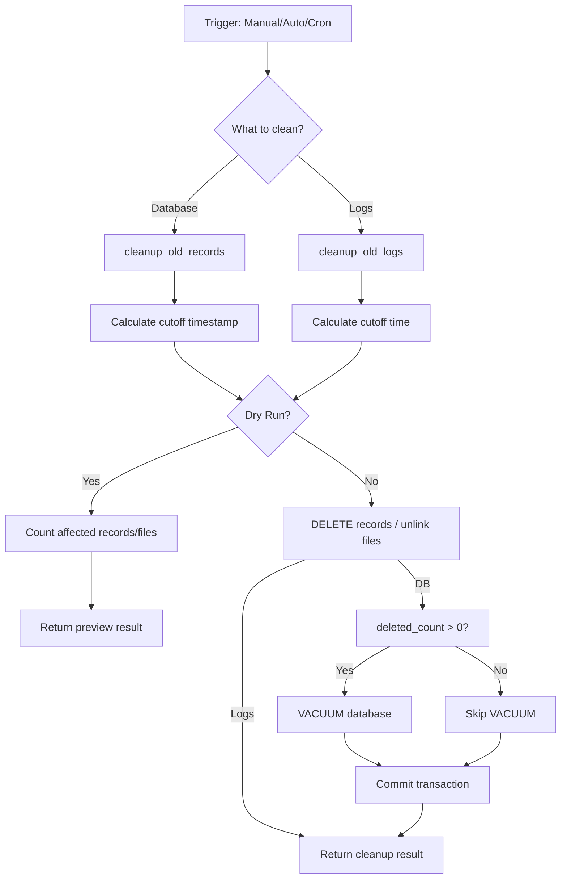

# Data Cleanup Design

## 概述

本文档描述 PaperTracker 的数据清理功能，用于自动或手动删除过期的论文内容记录和日志文件，控制存储空间。

## 设计目标

1. **自动化**：支持配置驱动的自动清理
2. **安全性**：提供 `--dry-run` 模式预览删除内容
3. **灵活性**：支持手动清理、自动清理、定时任务等多种触发方式
4. **可观测**：清理前后显示存储状态变化

## 配置设计

### 1. config.py

```python
@dataclass(frozen=True, slots=True)
class AppConfig:
    # ... 现有字段 ...
    state_enabled: bool = False
    state_db_path: str = "database/papers.db"
    content_storage_enabled: bool = True  # 是否启用内容存储

    # 内容存储清理配置
    retention_days: int | None = None      # 保留天数，None=不自动清理
    cleanup_on_exit: bool = False          # 退出时是否清理
```

### 2. config/default.yml

```yaml
state:
  enabled: true
  db_path: null                      # 默认 database/papers.db
  content_storage_enabled: true      # 是否保存完整内容
  retention_days: 90                 # 保留最近90天的数据，null=不清理
  cleanup_on_exit: false             # 程序退出时自动清理
```

## 代码实现

### 1. 数据库清理 (content.py)

```python
# src/PaperTracker/storage/content.py

from datetime import datetime, timezone, timedelta

class PaperContentStore:
    # ... 现有方法 ...

    def cleanup_old_records(self, retention_days: int, dry_run: bool = False) -> dict:
        """Delete records older than retention_days.

        Args:
            retention_days: Keep records from the last N days.
            dry_run: If True, only report what would be deleted.

        Returns:
            Dictionary with cleanup statistics.
        """
        cutoff_timestamp = int(
            (datetime.now(timezone.utc) - timedelta(days=retention_days)).timestamp()
        )

        if dry_run:
            cursor = self.conn.execute("""
                SELECT COUNT(*) as total,
                       MIN(fetched_at) as oldest,
                       MAX(fetched_at) as newest
                FROM paper_content
                WHERE fetched_at < ?
            """, (cutoff_timestamp,))
            row = cursor.fetchone()
            return {
                "action": "dry_run",
                "would_delete": row[0],
                "oldest_fetched_at": row[1],
                "newest_fetched_at": row[2],
                "cutoff_timestamp": cutoff_timestamp,
            }

        # 执行删除
        cursor = self.conn.execute("""
            DELETE FROM paper_content
            WHERE fetched_at < ?
        """, (cutoff_timestamp,))

        deleted_count = cursor.rowcount

        # 优化数据库（回收空间）
        if deleted_count > 0:
            self.conn.execute("VACUUM")

        self.conn.commit()
        log.info("Cleaned up %d records older than %d days", deleted_count, retention_days)

        return {
            "action": "deleted",
            "deleted_count": deleted_count,
            "cutoff_timestamp": cutoff_timestamp,
        }

    def get_storage_size(self) -> dict:
        """Get database storage size information.

        Returns:
            Dictionary with size statistics.
        """
        cursor = self.conn.execute("PRAGMA page_size")
        page_size = cursor.fetchone()[0]

        cursor = self.conn.execute("PRAGMA page_count")
        page_count = cursor.fetchone()[0]

        total_bytes = page_size * page_count

        cursor = self.conn.execute("""
            SELECT COUNT(*) FROM paper_content
        """)
        record_count = cursor.fetchone()[0]

        return {
            "total_bytes": total_bytes,
            "total_mb": round(total_bytes / (1024 * 1024), 2),
            "record_count": record_count,
            "avg_bytes_per_record": round(total_bytes / record_count, 2) if record_count > 0 else 0,
        }
```

### 2. 日志清理 (utils/cleanup.py)

```python
# src/PaperTracker/utils/cleanup.py

from datetime import datetime, timezone, timedelta
from pathlib import Path

from PaperTracker.utils.log import log


def cleanup_old_logs(log_dir: Path, retention_days: int, dry_run: bool = False) -> dict:
    """Delete log files older than retention_days.

    Args:
        log_dir: Directory containing log files.
        retention_days: Keep logs from the last N days.
        dry_run: If True, only report what would be deleted.

    Returns:
        Dictionary with cleanup statistics.
    """
    if not log_dir.exists():
        return {"action": "skipped", "reason": "log_dir does not exist"}

    cutoff_time = datetime.now(timezone.utc) - timedelta(days=retention_days)
    log_files = list(log_dir.glob("*.log"))

    if dry_run:
        would_delete = []
        total_size = 0
        for log_file in log_files:
            # 从文件名解析日期（假设格式：app-2025-01-30.log）
            try:
                file_mtime = datetime.fromtimestamp(log_file.stat().st_mtime, timezone.utc)
                if file_mtime < cutoff_time:
                    would_delete.append(str(log_file))
                    total_size += log_file.stat().st_size
            except Exception as e:
                log.warning("Failed to parse log file %s: %s", log_file, e)

        return {
            "action": "dry_run",
            "would_delete_count": len(would_delete),
            "would_delete_files": would_delete,
            "would_free_bytes": total_size,
        }

    # 执行删除
    deleted_count = 0
    total_freed = 0
    for log_file in log_files:
        try:
            file_mtime = datetime.fromtimestamp(log_file.stat().st_mtime, timezone.utc)
            if file_mtime < cutoff_time:
                size = log_file.stat().st_size
                log_file.unlink()
                deleted_count += 1
                total_freed += size
                log.debug("Deleted old log file: %s", log_file)
        except Exception as e:
            log.warning("Failed to delete log file %s: %s", log_file, e)

    return {
        "action": "deleted",
        "deleted_count": deleted_count,
        "freed_bytes": total_freed,
    }
```

### 3. CLI 命令

#### 3.1 search 命令集成自动清理

```python
# src/PaperTracker/cli.py

@cli.command("search")
@click.pass_context
def search_cmd(ctx: click.Context) -> None:
    cfg = ctx.obj
    configure_logging(...)

    dedup_store = None
    content_store = None

    try:
        if cfg.state_enabled:
            db_path = Path(cfg.state_db_path)
            dedup_store = SqliteDeduplicateStore(db_path)
            if cfg.content_storage_enabled:
                content_store = PaperContentStore(db_path)

        # 搜索论文
        papers = service.search(query, ...)
        log.info("Fetched %d papers", len(papers))

        # 去重
        if dedup_store:
            new_papers = dedup_store.filter_new(papers)
            log.info("New papers: %d", len(new_papers))
            dedup_store.mark_seen(papers)

            if content_store:
                content_store.save_papers(papers)

            papers = new_papers

        # 输出...

    finally:
        # 退出时清理（如果启用）
        if content_store and cfg.cleanup_on_exit and cfg.retention_days:
            log.info("Running cleanup on exit (retention: %d days)", cfg.retention_days)
            result = content_store.cleanup_old_records(cfg.retention_days)
            log.info("Cleanup result: %s", result)

        # 关闭连接
        if dedup_store:
            dedup_store.close()
        if content_store:
            content_store.close()
```

#### 3.2 cleanup 命令

```python
# src/PaperTracker/cli.py

@cli.command("cleanup")
@click.option("--dry-run", is_flag=True, help="Show what would be deleted without actually deleting")
@click.option("--days", type=int, default=None, help="Retention period (overrides config)")
@click.option("--logs", is_flag=True, help="Clean up old log files")
@click.pass_context
def cleanup_cmd(ctx: click.Context, dry_run: bool, days: int | None, logs: bool) -> None:
    """Clean up old paper content records and/or log files."""
    cfg = ctx.obj
    configure_logging(cfg.log_level, to_file=cfg.log_to_file, log_dir=cfg.log_dir)

    # 清理数据库
    if cfg.state_enabled and cfg.content_storage_enabled:
        db_path = Path(cfg.state_db_path)
        content_store = PaperContentStore(db_path)

        try:
            retention_days = days if days is not None else cfg.retention_days
            if retention_days is None:
                log.info("No retention period configured for database, skipping DB cleanup")
            else:
                size_info = content_store.get_storage_size()
                log.info("Current storage: %s records, %.2f MB",
                         size_info["record_count"], size_info["total_mb"])

                result = content_store.cleanup_old_records(retention_days, dry_run=dry_run)

                if dry_run:
                    log.info("[DRY RUN] Would delete %d DB records fetched before %s",
                             result["would_delete"],
                             datetime.fromtimestamp(result["cutoff_timestamp"]))
                else:
                    log.info("Deleted %d DB records", result["deleted_count"])

                    size_info_after = content_store.get_storage_size()
                    log.info("Storage after cleanup: %s records, %.2f MB",
                             size_info_after["record_count"], size_info_after["total_mb"])
        finally:
            content_store.close()

    # 清理日志
    if logs or (dry_run and days):
        log_dir = Path(cfg.log_dir) if cfg.log_dir else Path("log")
        result = cleanup_old_logs(log_dir, days or cfg.retention_days or 30, dry_run=dry_run)

        if dry_run:
            log.info("[DRY RUN] Would delete %d log files, %.2f MB",
                     result["would_delete_count"],
                     result["would_free_bytes"] / (1024 * 1024))
        else:
            log.info("Deleted %d log files, freed %.2f MB",
                     result["deleted_count"],
                     result["freed_bytes"] / (1024 * 1024))
```

#### 3.3 storage-info 命令

```python
# src/PaperTracker/cli.py

@cli.command("storage-info")
@click.pass_context
def storage_info_cmd(ctx: click.Context) -> None:
    """Show content storage statistics."""
    cfg = ctx.obj
    configure_logging(cfg.log_level, to_file=cfg.log_to_file, log_dir=cfg.log_dir)

    if not cfg.state_enabled or not cfg.content_storage_enabled:
        log.error("Content storage is not enabled")
        raise click.ClickException("Content storage is not enabled")

    db_path = Path(cfg.state_db_path)
    content_store = PaperContentStore(db_path)

    try:
        stats = content_store.get_statistics()
        size_info = content_store.get_storage_size()

        click.echo("\n=== Paper Content Storage Info ===\n")
        click.echo(f"Total Records: {stats['total_records']}")
        click.echo(f"Unique Papers: {stats['unique_papers']}")
        click.echo(f"Categories: {stats['categories']}")
        click.echo(f"Storage Size: {size_info['total_mb']} MB")
        click.echo(f"Avg per Record: {size_info['avg_bytes_per_record']} bytes")
        click.echo(f"First Fetch: {datetime.fromtimestamp(stats['first_fetch'])}")
        click.echo(f"Last Fetch: {datetime.fromtimestamp(stats['last_fetch'])}")
        click.echo()

    finally:
        content_store.close()
```

## 使用场景

### 场景 1：手动清理数据库

```bash
# 查看存储状态
paper-tracker storage-info

# 预览清理（不实际删除）
paper-tracker cleanup --dry-run --days 90

# 实际清理超过 90 天的数据
paper-tracker cleanup --days 90

# 使用配置文件中的 retention_days 设置
paper-tracker cleanup
```

### 场景 2：手动清理日志

```bash
# 预览清理
paper-tracker cleanup --logs --dry-run --days 30

# 实际清理 30 天前的日志
paper-tracker cleanup --logs --days 30
```

### 场景 3：同时清理数据库和日志

```bash
# 清理所有超过 90 天的数据
paper-tracker cleanup --days 90 --logs
```

### 场景 4：自动清理（配置驱动）

```yaml
# config/default.yml
state:
  enabled: true
  content_storage_enabled: true
  retention_days: 90        # 保留 90 天
  cleanup_on_exit: true     # 每次运行后自动清理
```

```python
# 程序每次运行结束后自动清理
# 用户无需手动执行 cleanup 命令
paper-tracker search  # 搜索完成后自动清理旧数据
```

### 场景 5：定时任务（生产环境）

```bash
# Crontab 示例：每天凌晨 2 点清理
0 2 * * * /usr/bin/paper-tracker cleanup --days 90 --logs >> /var/log/paper-tracker/cleanup.log 2>&1
```

## 清理策略

| 策略 | 触发方式 | 适用场景 |
|------|---------|---------|
| 手动清理 | `paper-tracker cleanup` | 按需维护 |
| 自动清理 | `cleanup_on_exit: true` | 长期运行的自动化脚本 |
| 定时任务 | Cron / systemd timer | 生产环境定时维护 |

## 性能考虑

### 清理开销

- **数据库删除**：O(n)，n 为旧记录数
- **VACUUM 操作**：O(m)，m 为数据库总大小
- **日志删除**：O(k)，k 为日志文件数
- **建议**：在低峰期执行或使用 `--dry-run` 预览

### VACUUM 机制

SQLite 的 DELETE 操作不会回收磁盘空间，VACUUM 会：
1. 将数据库内容复制到临时文件
2. 重建数据库文件
3. 替换原文件

对于大型数据库，VACUUM 可能需要较长时间。

### 优化建议

1. **分批清理**：如果单次清理时间过长，可考虑分批执行
2. **监控告警**：监控数据库大小，超过阈值时触发清理
3. **归档导出**：清理前可导出旧数据到归档文件
4. **日志轮转**：考虑使用 logrotate 进行日志管理

## 数据流图



## 配置示例

### 开发环境

```yaml
state:
  enabled: true
  retention_days: 30        # 保留 30 天
  cleanup_on_exit: false    # 手动清理

log:
  to_file: true
  dir: log
  level: DEBUG
```

### 生产环境

```yaml
state:
  enabled: true
  retention_days: 90        # 保留 90 天
  cleanup_on_exit: false    # 使用定时任务清理

log:
  to_file: true
  dir: /var/log/paper-tracker
  level: INFO
```

### 自动化脚本

```yaml
state:
  enabled: true
  retention_days: 7         # 保留 7 天
  cleanup_on_exit: true     # 每次运行后清理

log:
  to_file: true
  dir: log
  level: INFO
```
