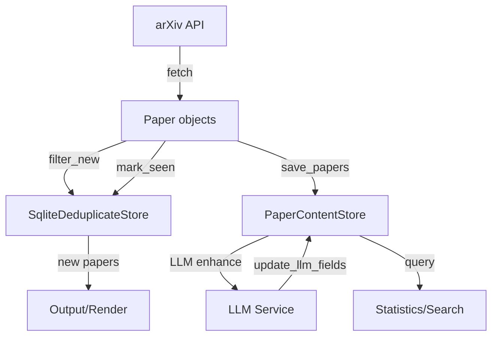

# Content Storage Architecture Design

## 概述

本文档描述 PaperTracker 的内容存储（Content Storage）架构设计，用于存储论文的完整详细数据，与去重存储（Deduplication Storage）形成互补。

## 设计目标

1. **关注点分离**：去重存储专注于快速判重，内容存储专注于完整数据管理
2. **扩展性**：为 LLM 增强功能（摘要、翻译）预留字段
3. **查询效率**：支持按时间、分类、关键词等多维度查询

## 架构设计

### 1. 存储层结构

```
src/PaperTracker/storage/
├── __init__.py
├── db.py              # 数据库连接和 schema 初始化
├── deduplicate.py     # 去重存储（seen_papers 表）
└── content.py         # 内容存储（paper_content 表）✨ 新增
```

### 2. 数据库设计

#### 2.2 表结构设计

##### seen_papers 表（去重，已存在）

```sql
CREATE TABLE IF NOT EXISTS seen_papers (
  id INTEGER PRIMARY KEY AUTOINCREMENT,
  source TEXT NOT NULL,
  source_id TEXT NOT NULL,
  doi TEXT,
  doi_norm TEXT GENERATED ALWAYS AS (...) STORED,
  title TEXT NOT NULL,
  first_seen_at INTEGER NOT NULL DEFAULT (CAST(strftime('%s','now') AS INTEGER)),
  UNIQUE(source, source_id)
);
```

**职责**：轻量级去重判断

##### paper_content 表（内容，新增）

```sql
CREATE TABLE IF NOT EXISTS paper_content (
  -- 主键和关联
  id INTEGER PRIMARY KEY AUTOINCREMENT,
  seen_paper_id INTEGER NOT NULL,
  
  -- 基础标识
  source TEXT NOT NULL,
  source_id TEXT NOT NULL,
  
  -- 核心内容
  title TEXT NOT NULL,
  authors TEXT NOT NULL,              -- JSON array: ["Author1", "Author2"]
  summary TEXT NOT NULL,
  
  -- 时间信息
  published_at INTEGER,               -- Unix timestamp
  updated_at INTEGER,                 -- Unix timestamp
  fetched_at INTEGER NOT NULL DEFAULT (CAST(strftime('%s','now') AS INTEGER)),
  
  -- 分类信息
  primary_category TEXT,
  categories TEXT,                    -- JSON array: ["cs.CV", "cs.AI"]
  
  -- 链接信息
  abstract_url TEXT,
  pdf_url TEXT,
  code_urls TEXT,                     -- JSON array: ["https://github.com/..."]
  project_urls TEXT,                  -- JSON array: ["https://project.com"]
  doi TEXT,
  
  -- LLM 增强字段（翻译）
  translation TEXT,                   -- 翻译后的摘要内容
  language TEXT,                      -- 翻译的目标语言 (e.g., 'zh', 'en')
  
  -- 扩展字段
  extra TEXT,                         -- JSON object for provider-specific fields
  
  -- 约束
  FOREIGN KEY (seen_paper_id) REFERENCES seen_papers(id) ON DELETE CASCADE,
  UNIQUE(source, source_id, fetched_at)  -- 允许同一论文多次抓取（版本追踪）
);
```

**职责**：完整内容存储和 LLM 增强

##### 索引设计

```sql
-- seen_papers 索引（已存在）
CREATE INDEX IF NOT EXISTS idx_seen_doi_norm 
  ON seen_papers(doi_norm) 
  WHERE doi_norm IS NOT NULL AND doi_norm <> '';

CREATE INDEX IF NOT EXISTS idx_seen_first_seen 
  ON seen_papers(first_seen_at);

-- paper_content 索引（新增）
CREATE INDEX IF NOT EXISTS idx_content_seen_paper 
  ON paper_content(seen_paper_id);

CREATE INDEX IF NOT EXISTS idx_content_source_id 
  ON paper_content(source, source_id);

CREATE INDEX IF NOT EXISTS idx_content_fetched 
  ON paper_content(fetched_at);

CREATE INDEX IF NOT EXISTS idx_content_category 
  ON paper_content(primary_category);
```


### 3. 代码实现

#### 3.1 数据库连接管理

为避免连接资源浪费、事务隔离问题和并发写入冲突，引入共享连接管理器：

```python
# src/PaperTracker/storage/db.py

class DatabaseManager:
    """Shared database connection manager."""
    _instance = None

    def __new__(cls, db_path: Path):
        if cls._instance is None:
            cls._instance = super().__new__(cls)
            cls._instance.conn = ensure_db(db_path)
            init_schema(cls._instance.conn)
        return cls._instance

    def get_connection(self) -> sqlite3.Connection:
        """Get the shared database connection."""
        return self.conn
```

#### 3.2 更新 db.py

```python
# src/PaperTracker/storage/db.py

def init_schema(conn: sqlite3.Connection) -> None:
    """Initialize database schema for both deduplication and content storage."""
    conn.executescript("""
        -- seen_papers 表（已存在，保持不变）
        CREATE TABLE IF NOT EXISTS seen_papers (...);
        
        -- paper_content 表（新增）
        CREATE TABLE IF NOT EXISTS paper_content (
          id INTEGER PRIMARY KEY AUTOINCREMENT,
          seen_paper_id INTEGER NOT NULL,
          source TEXT NOT NULL,
          source_id TEXT NOT NULL,
          title TEXT NOT NULL,
          authors TEXT NOT NULL,
          summary TEXT NOT NULL,
          published_at INTEGER,
          updated_at INTEGER,
          fetched_at INTEGER NOT NULL DEFAULT (CAST(strftime('%s','now') AS INTEGER)),
          primary_category TEXT,
          categories TEXT,
          abstract_url TEXT,
          pdf_url TEXT,
          code_urls TEXT,
          project_urls TEXT,
          doi TEXT,
          translation TEXT,
          language TEXT,
          extra TEXT,
          FOREIGN KEY (seen_paper_id) REFERENCES seen_papers(id) ON DELETE CASCADE,
          UNIQUE(source, source_id, fetched_at)
        );
        
        -- 索引
        CREATE INDEX IF NOT EXISTS idx_seen_doi_norm ON seen_papers(doi_norm) WHERE doi_norm IS NOT NULL;
        CREATE INDEX IF NOT EXISTS idx_seen_first_seen ON seen_papers(first_seen_at);
        CREATE INDEX IF NOT EXISTS idx_content_seen_paper ON paper_content(seen_paper_id);
        CREATE INDEX IF NOT EXISTS idx_content_source_id ON paper_content(source, source_id);
        CREATE INDEX IF NOT EXISTS idx_content_fetched ON paper_content(fetched_at);
        CREATE INDEX IF NOT EXISTS idx_content_category ON paper_content(primary_category);
    """)
    conn.commit()
```

#### 3.3 新增 content.py

```python
# src/PaperTracker/storage/content.py
"""Paper content storage implementation."""

from __future__ import annotations

import json
from pathlib import Path
from typing import Sequence

from PaperTracker.core.models import Paper
from PaperTracker.storage.db import ensure_db, init_schema
from PaperTracker.utils.log import log


class PaperContentStore:
    """SQLite-based content store for full paper data."""

    def __init__(self, db_manager: DatabaseManager):
        """Initialize content store.

        Args:
            db_manager: Shared database manager instance.
        """
        log.debug("Initializing PaperContentStore")
        self.conn = db_manager.get_connection()
    
    def save_papers(self, papers: Sequence[Paper]) -> None:
        """Save full paper content to database.
        
        Args:
            papers: Papers to save (must already exist in seen_papers).
        """
        if not papers:
            return
        
        for paper in papers:
            # 获取 seen_paper_id
            cursor = self.conn.execute(
                "SELECT id FROM seen_papers WHERE source = ? AND source_id = ?",
                (paper.source, paper.id)
            )
            row = cursor.fetchone()
            if not row:
                log.warning("Paper %s not in seen_papers, skipping content save", paper.id)
                continue
            
            seen_paper_id = row[0]
            
            # 提取链接（从 extra 字段）
            code_urls = paper.extra.get("code_urls", [])
            project_urls = paper.extra.get("project_urls", [])
            
            # 插入完整内容
            self.conn.execute("""
                INSERT INTO paper_content (
                    seen_paper_id, source, source_id, title, authors, summary,
                    published_at, updated_at, primary_category, categories,
                    abstract_url, pdf_url, code_urls, project_urls, doi, extra
                ) VALUES (?, ?, ?, ?, ?, ?, ?, ?, ?, ?, ?, ?, ?, ?, ?, ?)
            """, (
                seen_paper_id,
                paper.source,
                paper.id,
                paper.title,
                json.dumps(list(paper.authors), ensure_ascii=False),
                paper.summary,
                int(paper.published.timestamp()) if paper.published else None,
                int(paper.updated.timestamp()) if paper.updated else None,
                paper.primary_category,
                json.dumps(list(paper.categories), ensure_ascii=False),
                paper.links.abstract,
                paper.links.pdf,
                json.dumps(code_urls, ensure_ascii=False),
                json.dumps(project_urls, ensure_ascii=False),
                paper.doi,
                json.dumps(dict(paper.extra), ensure_ascii=False)
            ))
        
        self.conn.commit()
        log.debug("Saved %d papers to content store", len(papers))
    
    def update_translation(self, source_id: str, translation: str, language: str) -> None:
        """Update translation for a paper.

        Args:
            source_id: Paper source ID.
            translation: Translated summary content.
            language: Target language code (e.g., 'zh', 'en').
        """
        self.conn.execute(
            "UPDATE paper_content SET translation = ?, language = ? WHERE source_id = ?",
            (translation, language, source_id)
        )
        self.conn.commit()
        log.debug("Updated translation for paper %s to %s", source_id, language)
    
    def get_recent_papers(self, limit: int = 100, days: int = None) -> list[dict]:
        """Get recent papers from content store.
        
        Args:
            limit: Maximum number of papers to return.
            days: Optional filter for papers fetched in last N days.
        
        Returns:
            List of paper dictionaries.
        """
        query = """
            SELECT 
                c.source_id, c.title, c.authors, c.summary, 
                c.published_at, c.fetched_at, c.primary_category,
                c.abstract_url, c.pdf_url, c.code_urls,
                c.translation, c.language
            FROM paper_content c
        """
        params = []
        
        if days is not None:
            query += " WHERE c.fetched_at > strftime('%s', 'now', ?)"
            params.append(f"-{days} days")
        
        query += " ORDER BY c.fetched_at DESC LIMIT ?"
        params.append(limit)
        
        cursor = self.conn.execute(query, params)
        
        return [
            {
                "source_id": row[0],
                "title": row[1],
                "authors": json.loads(row[2]),
                "summary": row[3],
                "published_at": row[4],
                "fetched_at": row[5],
                "primary_category": row[6],
                "abstract_url": row[7],
                "pdf_url": row[8],
                "code_urls": json.loads(row[9]) if row[9] else [],
                "translation": row[10],
                "language": row[11],
            }
            for row in cursor
        ]
    
    def get_statistics(self) -> dict:
        """Get content store statistics.
        
        Returns:
            Dictionary with statistics.
        """
        cursor = self.conn.execute("""
            SELECT 
                COUNT(*) as total,
                COUNT(DISTINCT source_id) as unique_papers,
                COUNT(DISTINCT primary_category) as categories,
                MIN(fetched_at) as first_fetch,
                MAX(fetched_at) as last_fetch
            FROM paper_content
        """)
        row = cursor.fetchone()
        
        return {
            "total_records": row[0],
            "unique_papers": row[1],
            "categories": row[2],
            "first_fetch": row[3],
            "last_fetch": row[4],
        }
    
```


#### 3.4 集成到 CLI

```python
# src/PaperTracker/cli.py

from PaperTracker.storage.db import DatabaseManager
from PaperTracker.storage.deduplicate import SqliteDeduplicateStore
from PaperTracker.storage.content import PaperContentStore

@cli.command("search")
@click.pass_context
def search_cmd(ctx: click.Context) -> None:
    cfg = ctx.obj
    configure_logging(...)

    db_manager = None
    dedup_store = None
    content_store = None

    try:
        if cfg.state_enabled:
            db_path = Path(cfg.state_db_path)
            db_manager = DatabaseManager(db_path)
            dedup_store = SqliteDeduplicateStore(db_manager)
            if cfg.content_storage_enabled:
                content_store = PaperContentStore(db_manager)
                log.info("Content storage enabled: %s", db_path)

        # 搜索论文
        papers = service.search(query, ...)
        log.info("Fetched %d papers", len(papers))

        # 去重
        if dedup_store:
            new_papers = dedup_store.filter_new(papers)
            log.info("New papers: %d", len(new_papers))

            # 先标记已见（写入 seen_papers）
            dedup_store.mark_seen(papers)

            # 再保存完整内容（写入 paper_content）
            if content_store:
                content_store.save_papers(papers)

            papers = new_papers

        # 输出...

    finally:
        # 关闭连接（共享连接由 DatabaseManager 管理）
        pass
```

> **注意**：cleanup 和 storage-info 命令详见 `plans/cleanup.md`

### 4. 配置扩展

#### 4.1 config.py

```python
@dataclass(frozen=True, slots=True)
class AppConfig:
    # ... 现有字段 ...
    state_enabled: bool = False
    state_db_path: str = "database/papers.db"
    content_storage_enabled: bool = False  # 是否启用内容存储（默认关闭）
```

#### 4.2 config/default.yml

```yaml
state:
  enabled: true
  db_path: null  # 默认 database/papers.db
  content_storage_enabled: false  # 是否保存完整内容（默认关闭，需显式启用）
```

## 使用场景

### 场景 1：基础搜索 + 去重 + 内容存储

```python
# 1. 搜索论文
papers = service.search(query, max_results=50)

# 2. 去重
new_papers = dedup_store.filter_new(papers)

# 3. 标记已见
dedup_store.mark_seen(papers)

# 4. 保存完整内容
content_store.save_papers(papers)
```

### 场景 2：LLM 翻译后更新

```python
# 1. 获取最近的论文
recent = content_store.get_recent_papers(limit=10, days=1)

# 2. 调用 LLM 翻译摘要
for paper in recent:
    translation = llm.translate(paper["summary"], target_lang="zh")

    # NOTE 我们不在这个分支实现这个功能,先空着就行

    # 3. 更新翻译字段
    content_store.update_translation(
        paper["source_id"],
        translation=translation,
        language="zh"
    )
```

### 场景 3：统计分析

```python
# 获取统计信息
stats = content_store.get_statistics()
print(f"Total papers: {stats['total_records']}")
print(f"Unique papers: {stats['unique_papers']}")
print(f"Categories: {stats['categories']}")

# 按分类统计
cursor = conn.execute("""
    SELECT primary_category, COUNT(*)
    FROM paper_content
    GROUP BY primary_category
    ORDER BY COUNT(*) DESC
""")
```

## 数据流图



## 性能考虑

### 1. 写入性能

- **批量插入**：使用事务批量写入，避免频繁 commit
- **索引优化**：只在必要字段上建索引
- **JSON 字段**：authors/categories 等使用 JSON 存储，减少表结构复杂度

### 2. 查询性能

- **时间范围查询**：`fetched_at` 索引支持快速时间过滤
- **分类查询**：`primary_category` 索引支持分类统计
- **全文搜索**：FTS5 虚拟表支持高效全文检索

### 3. 存储优化

- **定期清理**：参考 `plans/cleanup.md` 进行数据清理
- **VACUUM**：定期压缩数据库文件
- **分离归档**：可选将旧数据导出到归档数据库

