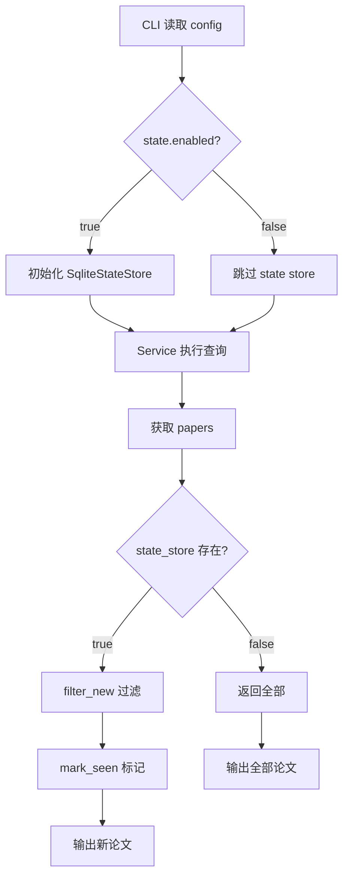

# 增量输出与去重（SQLite state）- 最终方案

## 目标

- 增量输出：默认只输出"本次新增"的论文
- SQLite 存储已见论文，支持未来多数据源
- 不新增 CLI 参数，只通过 YAML 配置控制

---

## 总体架构

### 分层与模块位置

```
src/PaperTracker/
  core/          # 领域模型与查询逻辑（无 I/O）
  services/      # 业务编排
  storage/       # NEW: 持久化层
    __init__.py  # 导出
    state.py     # SqliteStateStore
    db.py        # SQLite 工具
```

**设计原则**：
- `core/` 保持纯粹，无 I/O 操作
- `storage/` 层负责所有持久化逻辑
- CLI 层负责组装和调用 state store

---

## 数据库设计

### 数据库文件

- 默认：`state/paper_tracker.db`（绝对路径）
- 如果目录不存在，自动创建

### 核心表：`seen_papers`

```sql
CREATE TABLE IF NOT EXISTS seen_papers (
  id INTEGER PRIMARY KEY AUTOINCREMENT,

  source TEXT NOT NULL,            -- 数据源（arxiv / ieee / acm / …）
  source_id TEXT NOT NULL,         -- 该来源下的稳定 ID

  doi TEXT,                        -- 原始 DOI（可为空）
  doi_norm TEXT GENERATED ALWAYS AS (
    CASE 
      WHEN doi IS NULL OR trim(doi) = '' THEN NULL
      ELSE lower(
        trim(
          replace(
            replace(
              replace(
                replace(
                  replace(trim(doi), 'https://doi.org/', ''),
                'http://doi.org/', ''),
              'https://dx.doi.org/', ''),
            'http://dx.doi.org/', ''),
          'doi:', '')
        )
      )
    END
  ) STORED,                        -- 自动生成的规范化 DOI

  title TEXT NOT NULL,             -- 论文标题

  first_seen_at INTEGER NOT NULL DEFAULT (
    CAST(strftime('%s','now') AS INTEGER)
  ),
  -- first_seen_at 仅记录首次发现时间
  UNIQUE(source, source_id)
);
```

### 索引

```sql
-- DOI 查询（非唯一，允许多个 source_id 共享同一 DOI）
CREATE INDEX IF NOT EXISTS idx_seen_doi_norm
  ON seen_papers(doi_norm)
  WHERE doi_norm IS NOT NULL AND doi_norm <> '';

-- 按首次出现时间过滤
CREATE INDEX IF NOT EXISTS idx_seen_first_seen
  ON seen_papers(first_seen_at);
```

### 设计说明

- `source` / `source_id`：来源内唯一标识（未来多来源）
- `doi_norm`：数据库生成，作为跨来源去重参考（非唯一约束）
- `first_seen_at`：UTC epoch，记录首次发现时间
- DOI 冲突：移除唯一索引，改为普通索引，允许多个 source_id 共享同一 DOI

---

## 领域模型调整

### [`Paper`](../src/PaperTracker/core/models.py:24) 模型

在 `Paper` 中新增 `doi: Optional[str] = None` 字段：

```python
@dataclass(frozen=True, slots=True)
class Paper:
    source: str
    id: str
    title: str
    authors: Sequence[str]
    summary: str
    published: Optional[datetime]
    updated: Optional[datetime]
    primary_category: Optional[str] = None
    categories: Sequence[str] = ()
    links: PaperLinks = PaperLinks()
    doi: Optional[str] = None  # NEW
    extra: Mapping[str, Any] = field(default_factory=dict)
```

### arXiv Parser 提取 DOI

在 [`parser.py`](../src/PaperTracker/sources/arxiv/parser.py:31) 中提取 DOI：

```python
# 尝试从多个位置提取 DOI
doi = entry.get("arxiv_doi") or entry.get("doi") or None
if not doi:
    for link in entry.get("links", []):
        href = link.get("href", "")
        if "doi.org" in href:
            doi = href
            break
```

---

## 配置改动

### 配置结构

```yaml
state:
  enabled: true                      # 是否启用状态管理
  db_path: /absolute/path/to/state/paper_tracker.db  # 数据库绝对路径
```

**行为说明**：
- `enabled: true`：启用状态管理，只输出新论文
- `enabled: false`：禁用状态管理，不写入数据库，输出所有论文

### 配置解析

在 [`config.py`](../src/PaperTracker/config.py:1) 中新增：

```python
@dataclass(frozen=True, slots=True)
class StateConfig:
    """State management configuration."""
    enabled: bool = False
    db_path: str = "state/paper_tracker.db"

@dataclass(frozen=True, slots=True)
class AppConfig:
    # ... existing fields ...
    state: StateConfig = StateConfig()
```

解析逻辑：

```python
def load_config(path: Path) -> AppConfig:
    # ... existing code ...
    
    state_obj = raw.get("state", {})
    state_enabled = bool(_get(state_obj, "enabled", False))
    state_db_path = str(_get(state_obj, "db_path", "state/paper_tracker.db"))
    
    state = StateConfig(enabled=state_enabled, db_path=state_db_path)
    
    return AppConfig(
        # ... existing fields ...
        state=state,
    )
```

### 路径处理

- 只支持绝对路径
- 如果目录不存在，自动创建
- 不支持 `~` 展开和环境变量（简化实现）

---

## 新增/修改文件

### 1. 新增：`src/PaperTracker/storage/__init__.py`

```python
"""Storage layer for PaperTracker."""

from PaperTracker.storage.state import SqliteStateStore

__all__ = ["SqliteStateStore"]
```

### 2. 新增：`src/PaperTracker/storage/db.py`

```python
"""SQLite database utilities."""

import sqlite3
from pathlib import Path

def ensure_db(db_path: Path) -> sqlite3.Connection:
    """Ensure database file exists and return connection.
    
    Args:
        db_path: Absolute path to database file.
        
    Returns:
        SQLite connection.
        
    Raises:
        OSError: If directory creation fails.
        sqlite3.Error: If database connection fails.
    """
    db_path.parent.mkdir(parents=True, exist_ok=True)
    conn = sqlite3.connect(str(db_path))
    return conn

def init_schema(conn: sqlite3.Connection) -> None:
    """Initialize database schema.
    
    Args:
        conn: SQLite connection.
    """
    conn.executescript("""
        CREATE TABLE IF NOT EXISTS seen_papers (
          id INTEGER PRIMARY KEY AUTOINCREMENT,
          source TEXT NOT NULL,
          source_id TEXT NOT NULL,
          doi TEXT,
          doi_norm TEXT GENERATED ALWAYS AS (
            CASE 
              WHEN doi IS NULL OR trim(doi) = '' THEN NULL
              ELSE lower(
                trim(
                  replace(
                    replace(
                      replace(
                        replace(
                          replace(trim(doi), 'https://doi.org/', ''),
                        'http://doi.org/', ''),
                      'https://dx.doi.org/', ''),
                    'http://dx.doi.org/', ''),
                  'doi:', '')
                )
              )
            END
          ) STORED,
          title TEXT NOT NULL,
          first_seen_at INTEGER NOT NULL DEFAULT (
            CAST(strftime('%s','now') AS INTEGER)
          ),
          -- first_seen_at 仅记录首次发现时间
          UNIQUE(source, source_id)
        );
        
        CREATE INDEX IF NOT EXISTS idx_seen_doi_norm
          ON seen_papers(doi_norm)
          WHERE doi_norm IS NOT NULL AND doi_norm <> '';
        
        CREATE INDEX IF NOT EXISTS idx_seen_first_seen
          ON seen_papers(first_seen_at);
    """)
    conn.commit()
```

### 3. 新增：`src/PaperTracker/storage/state.py`

```python
"""State store implementation."""

from pathlib import Path
from typing import Sequence
import sqlite3

from PaperTracker.core.models import Paper
from PaperTracker.storage.db import ensure_db, init_schema
from PaperTracker.utils.log import log

class SqliteStateStore:
    """SQLite-based state store for tracking seen papers."""
    
    def __init__(self, db_path: Path):
        """Initialize state store.
        
        Args:
            db_path: Absolute path to database file.
            
        Raises:
            OSError: If directory creation fails.
            sqlite3.Error: If database initialization fails.
        """
        log.debug("Initializing SqliteStateStore at %s", db_path)
        self.conn = ensure_db(db_path)
        init_schema(self.conn)
    
    def filter_new(self, papers: Sequence[Paper]) -> list[Paper]:
        """Filter papers to only new ones not seen before.
        
        Args:
            papers: Papers to filter.
            
        Returns:
            List of papers not in the database.
        """
        if not papers:
            return []
        
        # Batch query
        placeholders = ",".join("?" * len(papers))
        query = f"""
            SELECT source_id FROM seen_papers 
            WHERE source = ? AND source_id IN ({placeholders})
        """
        
        cursor = self.conn.execute(
            query, 
            [papers[0].source] + [p.id for p in papers]
        )
        seen_ids = {row[0] for row in cursor}
        
        new_papers = [p for p in papers if p.id not in seen_ids]
        log.debug("Filtered %d new papers out of %d total", len(new_papers), len(papers))
        return new_papers
    
    def mark_seen(self, papers: Sequence[Paper]) -> None:
        """Mark papers as seen in the state store.
        
        Args:
            papers: Papers to mark as seen.
        """
        if not papers:
            return
        
        for paper in papers:
            self.conn.execute(
                """
                INSERT INTO seen_papers (source, source_id, doi, title)
                VALUES (?, ?, ?, ?)
                ON CONFLICT(source, source_id) DO UPDATE SET
                    title = excluded.title,
                    doi = excluded.doi
                """,
                (
                    paper.source,
                    paper.id,
                    paper.doi,
                    paper.title,
                ),
            )
        
        self.conn.commit()
        log.debug("Marked %d papers as seen", len(papers))
    
    def close(self) -> None:
        """Close database connection."""
        if self.conn:
            self.conn.close()
```

### 4. 修改：[`src/PaperTracker/core/models.py`](../src/PaperTracker/core/models.py:24)

在 `Paper` dataclass 中添加 `doi` 字段（见上文"领域模型调整"）。

### 5. 修改：[`src/PaperTracker/sources/arxiv/parser.py`](../src/PaperTracker/sources/arxiv/parser.py:31)

在 `parse_arxiv_feed` 函数中提取 DOI（见上文"领域模型调整"）。

### 6. 修改：[`src/PaperTracker/config.py`](../src/PaperTracker/config.py:1)

添加 `StateConfig` 和配置解析逻辑（见上文"配置改动"）。

### 7. 修改：[`src/PaperTracker/cli.py`](../src/PaperTracker/cli.py:67)

在 CLI 层集成 state store：

```python
from pathlib import Path
from PaperTracker.storage.state import SqliteStateStore

@cli.command("search")
@click.pass_context
def search_cmd(ctx: click.Context) -> None:
    cfg = ctx.obj
    configure_logging(...)
    
    try:
        # Initialize state store if enabled
        state_store = None
        if cfg.state.enabled:
            db_path = Path(cfg.state.db_path)
            state_store = SqliteStateStore(db_path)
            log.info("State management enabled: %s", db_path)
        
        service = PaperSearchService(...)
        
        for idx, query in enumerate(cfg.queries, start=1):
            # ... existing query logging ...
            
            papers = service.search(...)
            log.info("Fetched %d papers", len(papers))
            
            # Filter and mark if state enabled
            if state_store:
                new_papers = state_store.filter_new(papers)
                log.info("New papers: %d (filtered %d duplicates)", 
                        len(new_papers), len(papers) - len(new_papers))
                state_store.mark_seen(papers)
                papers = new_papers
            
            # ... existing rendering logic ...
        
        if state_store:
            state_store.close()
            
    except Exception as e:
        log.error("Search failed: %s", e)
        raise click.Abort from e
```

### 8. 更新：[`config/default.yml`](../config/default.yml:1)

添加 state 配置示例：

```yaml
# State management (deduplication)
state:
  enabled: true
  db_path: /absolute/path/to/state/paper_tracker.db

# ... existing config ...
```

---

## 核心处理流程



---

## 错误处理

### 数据库初始化失败

- 直接抛出异常，不支持降级
- 用户需要检查路径权限和磁盘空间

### 并发访问

- 不考虑并发问题（单进程设计）
- 如果需要并发，用户需要使用不同的 db_path

---

## 实现计划

### Phase 1: Foundation（核心功能）
1. 实现 [`storage/db.py`](../src/PaperTracker/storage/db.py:1)（数据库初始化、schema）
2. 实现 [`storage/state.py`](../src/PaperTracker/storage/state.py:1)（`SqliteStateStore`）
3. 修改 [`Paper`](../src/PaperTracker/core/models.py:24) 添加 `doi` 字段
4. 修改 [`parser.py`](../src/PaperTracker/sources/arxiv/parser.py:31) 提取 DOI

### Phase 2: Integration（集成）
5. 修改 [`config.py`](../src/PaperTracker/config.py:1) 添加 `StateConfig` 解析
6. 更新 [`config/default.yml`](../config/default.yml:1) 添加 `state` 配置
7. 修改 [`cli.py`](../src/PaperTracker/cli.py:67) 集成 state store

### Phase 3: Polish（完善）
8. 添加详细日志（新增数量、总量、去重统计）
9. 更新 [`docs/configuration.md`](../docs/configuration.md:1)

### Phase 4: Testing（可选）
10. 添加 `tests/test_state_store.py` 单元测试
11. 手动测试多种场景
